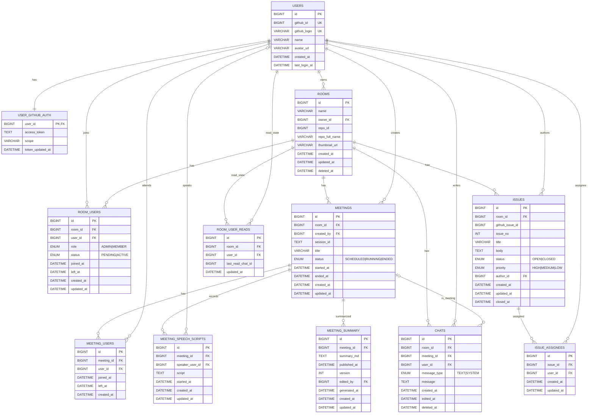

![[logical erd.svg]]
## 1) Users / Auth

### `users`

| 컬럼            | 타입           | 설명                      | 제약         |
| ------------- | ------------ | ----------------------- | ---------- |
| id            | BIGINT       | 내부 PK                   | PK         |
| github_id     | BIGINT       | GitHub numeric user id  | UNIQUE     |
| github_login  | VARCHAR(100) | GitHub 로그인 아이디(@handle) | UNIQUE(권장) |
| name          | VARCHAR(100) | GitHub 표시 이름            |            |
| avatar_url    | VARCHAR(500) | GitHub 프로필 이미지          |            |
| created_at    | DATETIME     | 생성일                     |            |
| last_login_at | DATETIME     | 마지막 로그인                 |            |

**인덱스/제약 권장**

- `UNIQUE(github_id)`
    
- `UNIQUE(github_login)` (검색/초대 기능 때문에 사실상 필수)
    

---

### `user_github_auth`

> OAuth 토큰은 users와 분리 저장(보안/관리 측면)

|컬럼|타입|설명|제약|
|---|---|---|---|
|user_id|BIGINT|users.id|PK, FK|
|access_token|TEXT|암호화 저장 권장||
|scope|VARCHAR(255)|부여된 권한 범위||
|token_updated_at|DATETIME|토큰 갱신 시각||

---

## 2) Rooms / Membership

### `rooms`

|컬럼|타입|설명|제약|
|---|---|---|---|
|id|BIGINT|방 PK|PK|
|name|VARCHAR(100)|방 이름||
|owner_id|BIGINT|방 생성자|FK → users.id|
|repo_id|BIGINT|GitHub repo numeric id (동기화 키)|INDEX|
|repo_full_name|VARCHAR(255)|`org/repo` 형태|(선택) UNIQUE|
|thumbnail_url|VARCHAR(500)|방 대표 이미지||
|created_at|DATETIME|생성||
|updated_at|DATETIME|수정||
|deleted_at|DATETIME|soft delete|NULL 허용|

**메모**

- repo 기반 서비스를 굴릴 거라면 `repo_id` 저장 추천(레포 이름 변경에도 안전).
    

---

### `room_users`

|컬럼|타입|설명|제약|
|---|---|---|---|
|id|BIGINT|PK|PK|
|room_id|BIGINT|방|FK → rooms.id|
|user_id|BIGINT|유저|FK → users.id|
|role|ENUM('ADMIN','MEMBER')|권한||
|status|ENUM('PENDING','ACTIVE')|초대 수락/활성 상태||
|joined_at|DATETIME|실제 참여 시작|NULL 허용|
|left_at|DATETIME|탈퇴 시각|NULL 허용|
|created_at|DATETIME|생성||
|updated_at|DATETIME|수정||

**인덱스/제약 권장**

- `UNIQUE(room_id, user_id)` (중복 참가 방지)
    
- 조회 성능: `INDEX(room_id)`, `INDEX(user_id)`
    

---

## 3) Meetings / 참석 / 음성 / 요약

### `meetings`

|컬럼|타입|설명|제약|
|---|---|---|---|
|id|BIGINT|PK|PK|
|room_id|BIGINT|방|FK → rooms.id|
|created_by|BIGINT|회의 생성자|FK → users.id|
|session_id|TEXT|OpenVidu 세션 ID 등||
|title|VARCHAR(50)|회의 제목||
|status|ENUM('SCHEDULED','RUNNING','ENDED')|상태||
|started_at|DATETIME|시작 시각|NULL 허용|
|ended_at|DATETIME|종료 시각|NULL 허용|
|created_at|DATETIME|생성||
|updated_at|DATETIME|수정||

---

### `meeting_users`

|컬럼|타입|설명|제약|
|---|---|---|---|
|id|BIGINT|PK|PK|
|meeting_id|BIGINT|회의|FK → meetings.id|
|user_id|BIGINT|참석자|FK → users.id|
|joined_at|DATETIME|입장 시각|NULL 허용|
|left_at|DATETIME|퇴장 시각|NULL 허용|
|created_at|DATETIME|생성||

**인덱스/제약 권장**

- `UNIQUE(meeting_id, user_id)`
    

---

### `meeting_speech_scripts`

> 회의 음성 → 텍스트 스크립트 저장  
> (지금 형태도 가능하지만, “구간/청크 기반”으로 확장 여지 남겨두는 걸 추천)

|컬럼|타입|설명|제약|
|---|---|---|---|
|id|BIGINT|PK|PK|
|meeting_id|BIGINT|회의|FK → meetings.id|
|speaker_user_id|BIGINT|화자(추정)|FK → users.id, NULL 허용|
|script|TEXT|텍스트 스크립트||
|started_at|DATETIME|해당 스크립트 시작 시각(또는 구간 기준)|NULL 허용|
|updated_at|DATETIME|수정||
|created_at|DATETIME|생성||

**추가 확장(선택)**

- `segment_index`, `start_ms`, `end_ms` (진짜 회의록 품질/재처리에 매우 유리)
    

---

### `meeting_summary`

> AI 요약본(편집 가능) + 게시 상태

|컬럼|타입|설명|제약|
|---|---|---|---|
|id|BIGINT|PK|PK|
|meeting_id|BIGINT|회의|FK → meetings.id|
|summary_md|TEXT|요약 마크다운||
|version|INT|요약 버전||
|edited_by|BIGINT|최종 편집자|FK → users.id, NULL 허용|
|generated_at|DATETIME|AI 생성 시각||
|published_at|DATETIME|“게시/업로드 완료 시각”|NULL 허용|
|created_at|DATETIME|생성||
|updated_at|DATETIME|수정||

**메모**

- 네가 적은 “published_at: github에 업로드 했는지”는 **시간 컬럼**이니까 의미를 이렇게 정리하면 좋음:
    
    - 업로드/게시 완료되면 timestamp 기록, 아니면 NULL.
        

**제약 추천**

- 버전 관리하면: `UNIQUE(meeting_id, version)`
    
- 1개만 유지하면: `UNIQUE(meeting_id)` + version 제거
    

---

## 4) Issues (GitHub 연동)

### `issues`

|컬럼|타입|설명|제약|
|---|---|---|---|
|id|BIGINT|내부 PK|PK|
|room_id|BIGINT|방|FK → rooms.id|
|github_issue_id|BIGINT|GitHub issue numeric id(동기화 키)|INDEX|
|issue_no|INT|GitHub issue number(#123)|INDEX|
|title|VARCHAR(255)|제목||
|body|TEXT|본문||
|status|ENUM('OPEN','CLOSED')|상태||
|priority|ENUM('HIGH','MEDIUM','LOW')|우선순위||
|author_id|BIGINT|작성자|FK → users.id|
|created_at|DATETIME|생성||
|updated_at|DATETIME|수정||
|closed_at|DATETIME|닫힘|NULL 허용|

**정리 포인트(중요)**

- 기존 `assignee_id`, `assignees_id(TEXT)`, `label`은 유지하면 나중에 고생함  
    → 아래처럼 조인 테이블로 정규화 추천.
    

---

### `issue_assignees`

> 이슈 담당자 N:M

|컬럼|타입|설명|제약|
|---|---|---|---|
|id|BIGINT|PK|PK|
|issue_id|BIGINT|이슈|FK → issues.id|
|user_id|BIGINT|담당자|FK → users.id|
|created_at|DATETIME|생성||
|updated_at|DATETIME|수정||

**제약 추천**

- `UNIQUE(issue_id, user_id)`
    

---

#### (선택) Labels / Milestone 정규화

- `labels` / `issue_labels`
    
- `milestones` / `issues.milestone_id`
    

(MVP면 label/milestone은 TEXT로 시작, 추후 분리)

---

## 5) Chat (방/회의 채팅)

### `chats`

|컬럼|타입|설명|제약|
|---|---|---|---|
|id|BIGINT|PK|PK|
|room_id|BIGINT|방 채팅 소속|FK → rooms.id|
|meeting_id|BIGINT|회의 채팅 소속(회의실이면 값 있음)|FK → meetings.id, NULL 허용|
|user_id|BIGINT|작성자|FK → users.id|
|message_type|ENUM('TEXT','SYSTEM')|일반/시스템 메시지||
|message|TEXT|내용||
|created_at|DATETIME|생성||
|edited_at|DATETIME|수정|NULL 허용|
|deleted_at|DATETIME|삭제(soft delete)|NULL 허용|

**운영 규칙 제안**

- 회의실 채팅: `meeting_id NOT NULL`
    
- 방 채팅: `meeting_id IS NULL`
    

---

## (Recommend) 사이드바 “알림 있음” 구현용 최소 테이블

### `room_user_reads` (추천)

|컬럼|타입|설명|
|---|---|---|
|id|BIGINT||
|room_id|BIGINT||
|user_id|BIGINT||
|last_read_chat_id|BIGINT||
|updated_at|DATETIME||
