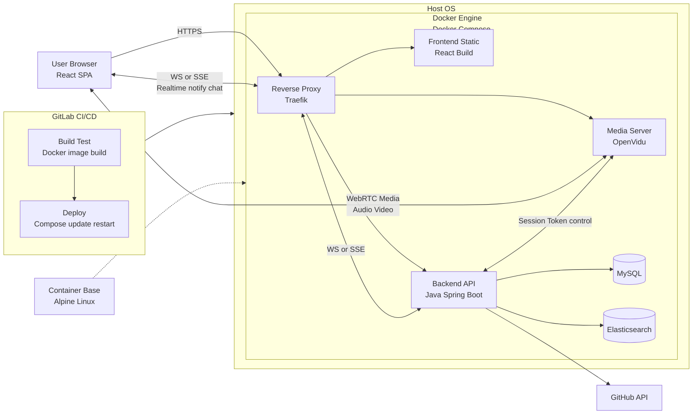

![[architecture.svg]]
### Frontend (FE)

- **React**
    

### Reverse Proxy / Ingress
-  **Traefik**

### Backend (BE)

- **Java**
    
- **Spring Boot**
    
- **Spring WebFlux**
    
- **JPA**
    

### Media Server

- **OpenVidu**
    

### Data (DB / Search)

- **MySQL**
    
- **Elasticsearch**
    

### Infra / DevOps

- **Docker Engine / Docker Compose**
    
- **GitLab CI/CD**
    

### OS

- **Ubuntu Server 20.04** _(호스트 OS)_
    
- **Alpine Linux** _(컨테이너 베이스 이미지/경량 런타임)_
    