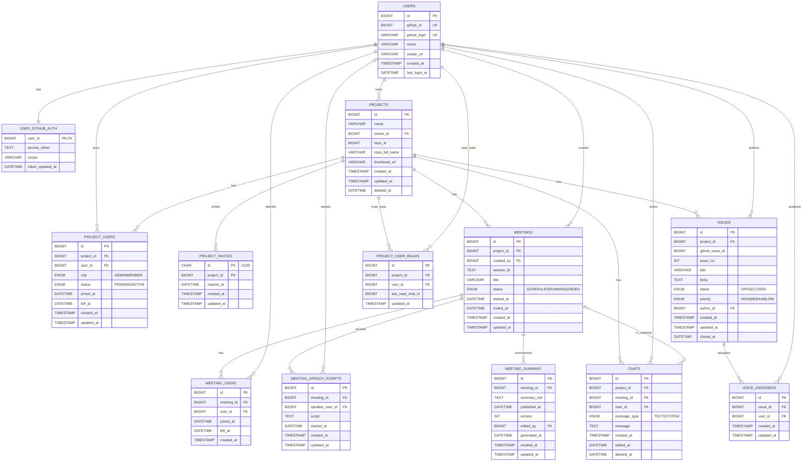

![[PERD.svg]]

## `users`

|컬럼|타입|NULL|기본값|KEY|설명|
|---|---|--:|---|---|---|
|id|BIGINT|NO|AUTO_INCREMENT|PK|내부 PK|
|github_id|BIGINT|NO||UK|GitHub numeric user id|
|github_login|VARCHAR(100)|NO||UK|GitHub 로그인 핸들|
|name|VARCHAR(100)|YES|||표시 이름|
|avatar_url|VARCHAR(500)|YES|||프로필 이미지|
|created_at|TIMESTAMP|NO|CURRENT_TIMESTAMP||생성 시각|
|last_login_at|DATETIME|YES|||마지막 로그인|

---

## `user_github_auth`

|컬럼|타입|NULL|기본값|KEY|설명|
|---|---|--:|---|---|---|
|user_id|BIGINT|NO||PK/FK|users.id|
|access_token|TEXT|NO|||OAuth 토큰(암호화 권장)|
|scope|VARCHAR(255)|YES|||권한 범위|
|token_updated_at|DATETIME|YES|||토큰 갱신 시각|

---

## `projects`

|컬럼|타입|NULL|기본값|KEY|설명|
|---|---|--:|---|---|---|
|id|BIGINT|NO|AUTO_INCREMENT|PK|프로젝트 PK|
|name|VARCHAR(100)|NO|||프로젝트 이름|
|owner_id|BIGINT|NO||FK|users.id (소유자)|
|repo_id|BIGINT|YES||IDX|GitHub repo numeric id|
|repo_full_name|VARCHAR(255)|YES||UK|`org/repo` (선택)|
|thumbnail_url|VARCHAR(500)|YES|||대표 이미지|
|created_at|TIMESTAMP|NO|CURRENT_TIMESTAMP||생성 시각|
|updated_at|TIMESTAMP|NO|CURRENT_TIMESTAMP + ON UPDATE||수정 시각|
|deleted_at|DATETIME|YES|||soft delete|

---

## `project_users`

|컬럼|타입|NULL|기본값|KEY|설명|
|---|---|--:|---|---|---|
|id|BIGINT|NO|AUTO_INCREMENT|PK|PK|
|project_id|BIGINT|NO||FK/UK|projects.id|
|user_id|BIGINT|NO||FK/UK|users.id|
|role|ENUM('ADMIN','MEMBER')|NO|||권한|
|status|ENUM('PENDING','ACTIVE')|NO|||초대/활성|
|joined_at|DATETIME|YES|||참여 시작|
|left_at|DATETIME|YES|||탈퇴 시각|
|created_at|TIMESTAMP|NO|CURRENT_TIMESTAMP||생성 시각|
|updated_at|TIMESTAMP|NO|CURRENT_TIMESTAMP + ON UPDATE||수정 시각|

**제약(권장/포함됨)**: `UNIQUE(project_id, user_id)`

---

## `project_invites`

|컬럼|타입|NULL|기본값|KEY|설명|
|---|---|--:|---|---|---|
|id|CHAR(36) (ascii)|NO||PK|UUID 초대 토큰|
|project_id|BIGINT|NO||FK/IDX|projects.id|
|expires_at|DATETIME|NO||IDX|만료 시각|
|created_at|TIMESTAMP|NO|CURRENT_TIMESTAMP||생성 시각|
|updated_at|TIMESTAMP|NO|CURRENT_TIMESTAMP + ON UPDATE||수정 시각|

---

## `meetings`

|컬럼|타입|NULL|기본값|KEY|설명|
|---|---|--:|---|---|---|
|id|BIGINT|NO|AUTO_INCREMENT|PK|회의 PK|
|project_id|BIGINT|NO||FK/IDX|projects.id|
|created_by|BIGINT|NO||FK/IDX|users.id|
|session_id|TEXT|NO|||OpenVidu 세션 ID 등|
|title|VARCHAR(50)|NO|||회의 제목|
|status|ENUM('SCHEDULED','RUNNING','ENDED')|NO|||상태|
|started_at|DATETIME|YES|||시작 시각|
|ended_at|DATETIME|YES|||종료 시각|
|created_at|TIMESTAMP|NO|CURRENT_TIMESTAMP||생성 시각|
|updated_at|TIMESTAMP|NO|CURRENT_TIMESTAMP + ON UPDATE||수정 시각|

---

## `meeting_users`

|컬럼|타입|NULL|기본값|KEY|설명|
|---|---|--:|---|---|---|
|id|BIGINT|NO|AUTO_INCREMENT|PK|PK|
|meeting_id|BIGINT|NO||FK/UK|meetings.id|
|user_id|BIGINT|NO||FK/UK|users.id|
|joined_at|DATETIME|YES|||입장|
|left_at|DATETIME|YES|||퇴장|
|created_at|TIMESTAMP|NO|CURRENT_TIMESTAMP||생성 시각|

**제약(권장/포함됨)**: `UNIQUE(meeting_id, user_id)`

---

## `meeting_speech_scripts`

|컬럼|타입|NULL|기본값|KEY|설명|
|---|---|--:|---|---|---|
|id|BIGINT|NO|AUTO_INCREMENT|PK|PK|
|meeting_id|BIGINT|NO||FK/IDX|meetings.id|
|speaker_user_id|BIGINT|YES||FK/IDX|users.id (화자 추정, nullable)|
|script|TEXT|NO|||전사 텍스트|
|started_at|DATETIME|YES|||구간 시작|
|created_at|TIMESTAMP|NO|CURRENT_TIMESTAMP||생성 시각|
|updated_at|TIMESTAMP|NO|CURRENT_TIMESTAMP + ON UPDATE||수정 시각|

---

## `meeting_summary`

|컬럼|타입|NULL|기본값|KEY|설명|
|---|---|--:|---|---|---|
|id|BIGINT|NO|AUTO_INCREMENT|PK|PK|
|meeting_id|BIGINT|NO||FK/UK|meetings.id|
|summary_md|TEXT|NO|||요약 마크다운|
|published_at|DATETIME|YES|||게시 완료 시각|
|version|INT|NO||UK|요약 버전|
|edited_by|BIGINT|YES||FK/IDX|users.id (편집자, nullable)|
|generated_at|DATETIME|NO|||AI 생성 시각|
|created_at|TIMESTAMP|NO|CURRENT_TIMESTAMP||생성 시각|
|updated_at|TIMESTAMP|NO|CURRENT_TIMESTAMP + ON UPDATE||수정 시각|

**제약(포함됨)**: `UNIQUE(meeting_id, version)`

---

## `issues`

|컬럼|타입|NULL|기본값|KEY|설명|
|---|---|--:|---|---|---|
|id|BIGINT|NO|AUTO_INCREMENT|PK|내부 PK|
|project_id|BIGINT|NO||FK/UK/IDX|projects.id|
|github_issue_id|BIGINT|NO||UK/IDX|GitHub issue numeric id|
|issue_no|INT|NO||IDX|GitHub issue number(#)|
|title|VARCHAR(255)|NO|||제목|
|body|TEXT|YES|||본문|
|status|ENUM('OPEN','CLOSED')|NO|||상태|
|priority|ENUM('HIGH','MEDIUM','LOW')|NO|||우선순위|
|author_id|BIGINT|NO||FK/IDX|users.id|
|created_at|TIMESTAMP|NO|CURRENT_TIMESTAMP||생성 시각|
|updated_at|TIMESTAMP|NO|CURRENT_TIMESTAMP + ON UPDATE||수정 시각|
|closed_at|DATETIME|YES|||닫힘 시각|

**제약(포함됨)**: `UNIQUE(project_id, github_issue_id)`

---

## `issue_assignees`

|컬럼|타입|NULL|기본값|KEY|설명|
|---|---|--:|---|---|---|
|id|BIGINT|NO|AUTO_INCREMENT|PK|PK|
|issue_id|BIGINT|NO||FK/UK/IDX|issues.id|
|user_id|BIGINT|NO||FK/UK/IDX|users.id|
|created_at|TIMESTAMP|NO|CURRENT_TIMESTAMP||생성 시각|
|updated_at|TIMESTAMP|NO|CURRENT_TIMESTAMP + ON UPDATE||수정 시각|

**제약(포함됨)**: `UNIQUE(issue_id, user_id)`

---

## `chats`

|컬럼|타입|NULL|기본값|KEY|설명|
|---|---|--:|---|---|---|
|id|BIGINT|NO|AUTO_INCREMENT|PK|PK|
|project_id|BIGINT|NO||FK/IDX|projects.id|
|meeting_id|BIGINT|YES||FK/IDX|meetings.id (회의 채팅이면 값 존재)|
|user_id|BIGINT|NO||FK/IDX|users.id|
|message_type|ENUM('TEXT','SYSTEM')|NO|||메시지 타입|
|message|TEXT|NO|||내용|
|created_at|TIMESTAMP|NO|CURRENT_TIMESTAMP||생성 시각|
|edited_at|DATETIME|YES|||수정 시각|
|deleted_at|DATETIME|YES|||삭제(soft)|

**인덱스(포함됨)**: `(project_id, created_at)`, `(meeting_id, created_at)`

---

## `project_user_reads`

|컬럼|타입|NULL|기본값|KEY|설명|
|---|---|--:|---|---|---|
|id|BIGINT|NO|AUTO_INCREMENT|PK|PK|
|project_id|BIGINT|NO||FK/UK/IDX|projects.id|
|user_id|BIGINT|NO||FK/UK/IDX|users.id|
|last_read_chat_id|BIGINT|YES||FK/IDX|chats.id (nullable)|
|updated_at|TIMESTAMP|NO|CURRENT_TIMESTAMP + ON UPDATE||갱신 시각|

**제약(포함됨)**: `UNIQUE(project_id, user_id)`
